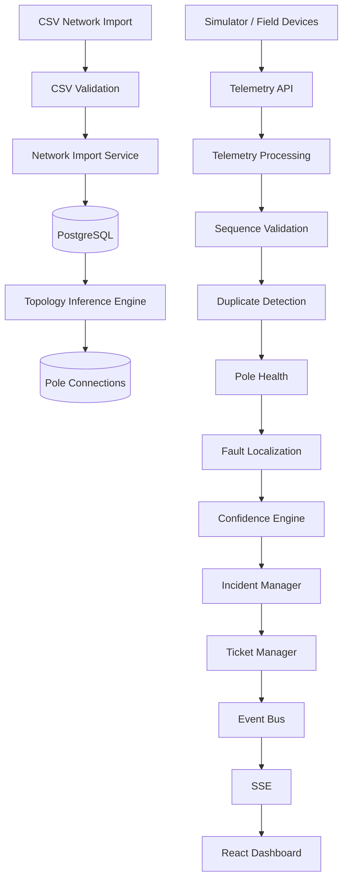

# Technical Design

## System Overview

Propel Grid Intelligence Platform is an event-driven fault localization platform for electrical distribution networks. The system imports network topology from utility registries, automatically reconstructs missing connectivity where required, processes real-time telemetry, localizes outages, computes confidence scores, manages incidents and tickets, and streams updates to operators through a live dashboard.

---

# System Architecture

---

# Data Sourcing & Ingestion

Telemetry is received through the `/api/telemetry` endpoint from either simulated devices or production telemetry sources.

The endpoint accepts the **device payload contract** from `02-data-and-systems.md`
(`device_id`, `pole_id`, `event`, `energized`, `ts`, `seq`, `battery_mv`,
`rssi`, `fw`) as well as the camelCase form used by the simulator, and
normalizes both to one canonical shape. `pole_id` is trusted for device
resolution when `device_id` is unknown (devices get swapped), and the
device's own `energized` reading is used to set pole state when present.

Every normalized telemetry packet carries:

- Device ID (+ optional pole ID)
- Event Type
- Sequence Number
- Device Timestamp (preserved for audit; operational logic uses receive time)
- RSSI
- Battery Voltage
- Firmware Version

The ingestion pipeline performs:

## Duplicate Detection

Each device maintains the latest processed sequence number.

Packets whose sequence number is less than or equal to the latest processed value are discarded.

This guarantees idempotent processing.

## Out-of-order Messages

Out-of-order packets are rejected using the stored sequence number.

This prevents stale telemetry from overwriting newer pole state.

## Boot Sessions

BOOT packets must always have sequence number 0 (non-conforming BOOTs are
logged and dropped rather than failing the request). Duplicate BOOT retries
within a two-minute window are ignored so a single power-return does not
churn boot sessions.

Note: because the device protocol does not stamp packets with their boot
session, a very stale retry from a *previous* session can still be accepted
after a reboot. This is inherent to the payload contract; the 30-second
observation window and the confidence engine absorb the consequences.

## Clock Skew

Device timestamps are preserved for audit purposes.

Operational logic relies on server receive time rather than device time to avoid clock skew issues.

## Burst Handling

Telemetry is serialized per device (a per-device queue), so no two packets
from the same device are ever processed concurrently and sequence order is
preserved. Per-transformer incident processing is additionally serialized
with a keyed mutex, so a 5,000-message burst cannot produce duplicate
incidents for the same boundary.

If a device's queue overflows, the packet is dropped and counted instead of
returning an error to the device — erroring would make the device retry
harder and worsen the burst.

---

# Storage Model

The platform stores three categories of information.

## Network Model

- Feeders
- Distribution Transformers
- Poles
- Pole Connections
- Devices

Topology is represented as a directed graph using the `pole_connections` table.

Each edge stores:

- source (Official / Inferred)
- confidence

Graph storage allows efficient traversal for localization while supporting both official and inferred topology simultaneously.

## Operational State

Current network state is maintained inside the `pole_health` table.

This stores:

- energized state
- health status
- latest heartbeat
- last telemetry
- RSSI
- battery
- firmware
- boot session

This acts as the canonical operational snapshot.

## Historical Data

Historical telemetry is stored in `telemetry_events`.

Incidents and tickets are stored independently to preserve operational history.

---

# Fault Localization Algorithm

Fault localization is debounced: a `power_lost` signal opens a **30-second
Candidate Observation Window** for its transformer (see `DECISIONS.md`,
"Fault Detection Debounce Strategy"). Duplicates, out-of-order retries and
further dark reports arrive inside the window without triggering work.
When the window elapses the transformer is re-evaluated; if the outage is
still present, localization runs. A `power_restored` signal cancels the
window and processes immediately.

Routine heartbeats update pole health but do not open observation windows.

## Step 1 — Find live→dark frontiers

The radial topology is traversed from the transformer root. Every
`LIVE → DARK` adjacent pair defines a fault boundary on that span.
Boundaries are deduplicated so a fork that reports the same frontier once.

## Step 2 — Handle UNKNOWN poles on the frontier

A boundary whose live pole is followed by one or more **UNKNOWN** poles
(no device, dead sensor, firmware-1.2 silence) before the first pole with
confirmed darkness is reported as a **RANGE**: the fault is on the range
between the live pole and the first confirmed-dark pole, with the silent
poles listed. The outage is never missed just because a boundary pole
cannot talk, and the operator sees a range rather than a false point span.

## Step 3 — Suppress physically impossible patterns

A DARK pole whose own downstream subtree contains a LIVE pole is
physically impossible as a line fault (power cannot skip past a break).
The assignment reads this signature as a lying sensor; such boundaries are
suppressed entirely and never become tickets.

## Step 4 — Whole-DT outages need evidence

When every pole with a *known* state under a transformer is DARK (at least
two independent reports), the fault is classified as a transformer/feeder
outage. A freshly imported or unreporting transformer — all poles UNKNOWN —
is **not** an outage, and a single dark report among many silent poles is
not escalated to a transformer-wide incident.

## Step 5 — Build Affected Subtree

Every downstream pole reachable from the boundary is marked as affected.

## Step 6 — Confidence Calculation

Confidence is computed using five independent evaluators:

- Topology completeness
- Boundary certainty (clean span > range > whole-DT)
- Telemetry quality (UNKNOWN poles are not counted as observed darkness)
- Sensor health (darkness derived from heartbeat silence scores low)
- Scheduled maintenance

The weighted score becomes the incident confidence.

## Step 7 — Incident Grouping

New localized faults are compared against existing active incidents.

If the affected subtree overlaps an existing incident, the incident is updated.

Otherwise a new incident is created — but only when the confidence exceeds
the creation threshold and no scheduled-outage window is active.

---

# Handling Missing Pole Ordering

Approximately 60% of transformers do not contain official pole ordering.

The platform automatically reconstructs topology.

Three states are detected:

- Complete topology
- Partial topology
- Missing topology

For missing topology:

- geographic nearest-neighbour search
- constrained spanning tree
- transformer-rooted traversal

For partial topology:

existing official connections are preserved while only missing edges are inferred.

Every inferred edge stores an associated confidence score.

---

# Computational Complexity

Topology inference (full MST path)

O(n log n)

Topology completion (partial path)

O(n²) — the nearest-connected-pole map is maintained incrementally.
Measured: a 240-pole line with 100 official edges completes in ~44 ms
(pure logic, see `npm run bench`).

Localization

O(V + E)

Incident grouping

O(k)

where k is the number of active incidents for the transformer.

Measured (pure logic, DB excluded, `npm run bench`): localization over a
240-pole radial tree ≈ 0.8 ms; confidence evaluation for a 60-pole
affected subtree ≈ 5 ms per 1,000 evaluations. End-to-end DB/network
latency is not claimed here.

---

# Known Failure Cases

The algorithm may produce incorrect localization when:

- GPS coordinates are inaccurate (inferred topology is wrong)
- all downstream telemetry devices fail simultaneously (a dead-sensor
  pattern indistinguishable from a feeder outage)
- the fault sits on a span whose boundary poles are both untelemetered —
  the RANGE report is honest about the uncertainty but cannot pin the edge

Confidence scores are reduced accordingly, and range/DT-level faults are
labelled as such in the incident so the operator sees what is certain and
what is not.

---

# Noise Handling

## Dead Sensors

The HeartbeatMonitor runs every 60 s. A pole whose heartbeat has been
silent for `HEARTBEAT_TIMEOUT_MINUTES` (default 15, matching the 15-minute
heartbeat cadence) is marked dark-with-silence: `isEnergized = false`,
`healthStatus = OFFLINE`, and its transformer enters the standard
observation window — this is how firmware-1.2 devices (which never send
`power_lost`) and the ~30% of lost dying messages are eventually detected.

Two guards stop this from crying wolf:

- The **impossible-pattern check** suppresses any dark pole whose children
  are still live — the canonical signature of a dead sensor, not a fault.
- The **sensor-health evaluator** scores darkness derived from silence
  (no `power_lost`, no recent heartbeat) at 0.3, so a real outage that is
  only visible through silence still reports with lowered confidence.

## Scheduled Maintenance

Darkness inside an advertised scheduled-outage window is **expected**, not
a fault: incident/ticket creation is suppressed while the window is active,
and the maintenance factor in the confidence breakdown reflects it. A
re-check is scheduled shortly after the window ends (15-minute grace), so a
genuine fault that survives the window — shutdowns overrun and are
sometimes cancelled without the feed being updated — still surfaces.

## Duplicate Telemetry

Duplicate packets are discarded using sequence validation.

## Debouncing

A `power_lost` signal opens a 30-second Candidate Observation Window for
its transformer; localization runs only when the window elapses and the
outage is still present. `power_restored` cancels the window and processes
immediately.

Routine heartbeats update operational state only.

---

# Startup Seeding

On startup (`start.sh`) the backend seeds a realistic synthetic network
when the database is empty (Gate G3):

- 3 feeders, 16 distribution transformers, ~600–1,200 poles
- radial lines with 1–4 branches and realistic 25–45 m pole spacing
- ~60% of transformers with NO official pole ordering (exercises topology
  inference immediately)
- ~9% of poles without devices, ~3% missing pincode
- ~8% of devices on firmware 1.2.x (silent on power loss)

The seed runs through the same CSV import path a reviewer would use, so it
cannot drift from the import behaviour. The sample CSVs in `sample-data/`
are also importable through the dashboard.

---

# API Surface

| Method | Endpoint | Purpose |
|---------|----------|----------|
| POST | /api/network/import | Import CSV network |
| GET | /api/network | Retrieve network |
| GET | /api/network/stats | Dashboard KPIs |
| POST | /api/telemetry | Receive telemetry |
| GET | /api/incidents | List incidents |
| GET | /api/incidents/active | Active incidents |
| GET | /api/incidents/history | Incident history |
| GET | /api/incidents/:id | Incident details |
| GET | /api/tickets | List tickets |
| PATCH | /api/tickets/:id/status | Update ticket status |
| POST | /api/simulator/boot | Simulate boot |
| POST | /api/simulator/heartbeat | Simulate heartbeat |
| POST | /api/simulator/power-lost | Simulate outage |
| POST | /api/simulator/power-restored | Restore power |
| POST | /api/simulator/span-fault | Simulate span fault (darkens whole downstream subtree) |
| POST | /api/simulator/transformer-fault | Simulate transformer fault |
| POST | /api/simulator/feeder-fault | Simulate feeder fault |
| POST | /api/simulator/repair | Simulate repair |
| POST | /api/simulator/device-failure | Simulate a device dying while power is fine |
| POST | /api/simulator/maintenance | Create a scheduled-outage window |
| GET | /api/events | Server-Sent Events |

All simulator fault endpoints accept an optional `noise` flag that produces
field-realistic telemetry: firmware-1.2 silence, ~30% lost dying messages,
duplicate retries and out-of-order packets.

---

# UI Design Rationale

The dashboard prioritizes operational awareness.

The interactive network map occupies the largest portion of the interface because operators primarily reason spatially. It fits the whole network (all transformers and poles) rather than centring on the first transformer, so the seeded multi-transformer network renders correctly. Pole colour encodes state (green healthy, red dark, orange heartbeat-timeout, purple affected-by-selected-incident) and official vs inferred topology is visually distinct.

Supporting panels provide:

- Active incidents
- Ticket workflow — includes PIN code and drive-to coordinates, and shows
  the server's rejection message when an action fails (e.g. marking a
  ticket RESOLVED while its span is still dark)
- Live event stream
- Operational brief
- Simulator controls

Less frequently used operational details are intentionally excluded from the primary view to reduce cognitive load.

---

# AI Feature

The Operational Brief panel summarizes the current operational state using live incident and ticket information.

In the current implementation, summaries are generated deterministically from structured incident data.

This avoids introducing latency or external dependencies during real-time operations.

Future versions may integrate an LLM to generate richer natural-language operational summaries.

If an AI model becomes unavailable, the deterministic summary remains available, ensuring operators always receive essential situational awareness.