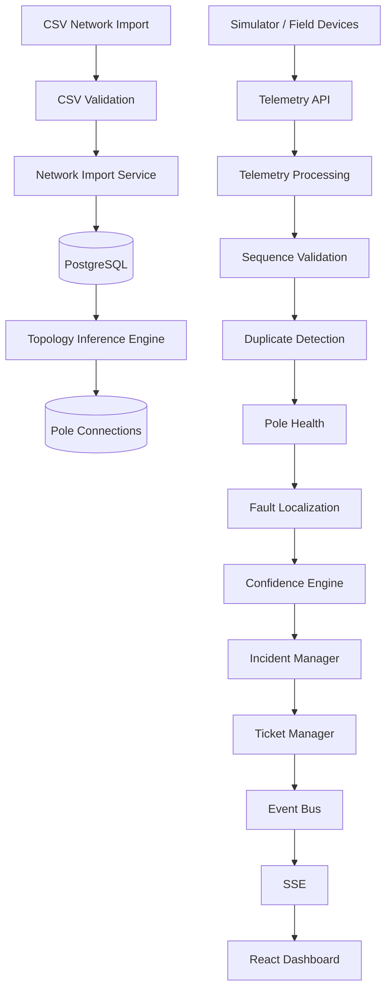

# Technical Design

## System Overview

Propel Grid Intelligence Platform is an event-driven fault localization platform for electrical distribution networks. The system imports network topology from utility registries, automatically reconstructs missing connectivity where required, processes real-time telemetry, localizes outages, computes confidence scores, manages incidents and tickets, and streams updates to operators through a live dashboard.

---

# System Architecture

---

# Data Sourcing & Ingestion

Telemetry is received through the `/api/telemetry` endpoint from either simulated devices or production telemetry sources.

Every telemetry packet contains:

- Device ID
- Event Type
- Sequence Number
- Device Timestamp
- RSSI
- Battery Voltage
- Firmware Version

The ingestion pipeline performs:

## Duplicate Detection

Each device maintains the latest processed sequence number.

Packets whose sequence number is less than or equal to the latest processed value are discarded.

This guarantees idempotent processing.

## Out-of-order Messages

Out-of-order packets are rejected using the stored sequence number.

This prevents stale telemetry from overwriting newer pole state.

## Boot Sessions

BOOT packets must always have sequence number 0.

Each boot creates a new boot session, allowing sequence numbers to safely restart after a device reboot.

## Clock Skew

Device timestamps are preserved for audit purposes.

Operational logic relies on server receive time rather than device time to avoid clock skew issues.

## Burst Handling

Telemetry events are processed sequentially.

Duplicate suppression and sequence validation ensure repeated bursts do not create duplicate incidents.

---

# Storage Model

The platform stores three categories of information.

## Network Model

- Feeders
- Distribution Transformers
- Poles
- Pole Connections
- Devices

Topology is represented as a directed graph using the `pole_connections` table.

Each edge stores:

- source (Official / Inferred)
- confidence

Graph storage allows efficient traversal for localization while supporting both official and inferred topology simultaneously.

## Operational State

Current network state is maintained inside the `pole_health` table.

This stores:

- energized state
- health status
- latest heartbeat
- last telemetry
- RSSI
- battery
- firmware
- boot session

This acts as the canonical operational snapshot.

## Historical Data

Historical telemetry is stored in `telemetry_events`.

Incidents and tickets are stored independently to preserve operational history.

---

# Fault Localization Algorithm

Fault localization begins whenever a meaningful telemetry state transition occurs.

Routine heartbeats update pole health but do not trigger localization.

## Step 1 — Detect Dark Poles

All poles reporting `POLE_DARK` are identified.

## Step 2 — Traverse Topology

The topology graph is traversed from the transformer root using Breadth-First Search (BFS).

Traversal stops at the first transition from an energized pole to a de-energized pole.

This transition defines the fault boundary.

## Step 3 — Build Affected Subtree

Every downstream pole reachable from the boundary is marked as affected.

## Step 4 — Confidence Calculation

Confidence is computed using five independent evaluators:

- Topology completeness
- Boundary certainty
- Telemetry quality
- Sensor health
- Scheduled maintenance

The weighted score becomes the incident confidence.

## Step 5 — Incident Grouping

New localized faults are compared against existing active incidents.

If the affected subtree overlaps an existing incident, the incident is updated.

Otherwise a new incident is created.

---

# Handling Missing Pole Ordering

Approximately 60% of transformers do not contain official pole ordering.

The platform automatically reconstructs topology.

Three states are detected:

- Complete topology
- Partial topology
- Missing topology

For missing topology:

- geographic nearest-neighbour search
- constrained spanning tree
- transformer-rooted traversal

For partial topology:

existing official connections are preserved while only missing edges are inferred.

Every inferred edge stores an associated confidence score.

---

# Computational Complexity

Topology inference

O(n log n)

Localization

O(V + E)

Incident grouping

O(k)

where k is the number of active incidents for the transformer.

---

# Known Failure Cases

The algorithm may produce incorrect localization when:

- GPS coordinates are inaccurate
- multiple independent faults occur within the same feeder
- all downstream telemetry devices fail simultaneously
- missing telemetry exists immediately adjacent to the fault

Confidence scores are reduced accordingly.

---

# Noise Handling

## Dead Sensors

Heartbeat timeout marks sensors offline.

This contributes negatively to confidence rather than immediately creating incidents.

## Scheduled Maintenance

Maintenance events reduce localization confidence to avoid false positives.

## Duplicate Telemetry

Duplicate packets are discarded using sequence validation.

## Debouncing

Only meaningful state transitions trigger localization.

Routine heartbeats update operational state only.

---

# API Surface

| Method | Endpoint | Purpose |
|---------|----------|----------|
| POST | /api/network/import | Import CSV network |
| GET | /api/network | Retrieve network |
| GET | /api/network/stats | Dashboard KPIs |
| POST | /api/telemetry | Receive telemetry |
| GET | /api/incidents | List incidents |
| GET | /api/incidents/active | Active incidents |
| GET | /api/incidents/history | Incident history |
| GET | /api/incidents/:id | Incident details |
| GET | /api/tickets | List tickets |
| PATCH | /api/tickets/:id | Update ticket status |
| POST | /api/simulator/boot | Simulate boot |
| POST | /api/simulator/heartbeat | Simulate heartbeat |
| POST | /api/simulator/power-lost | Simulate outage |
| POST | /api/simulator/power-restored | Restore power |
| POST | /api/simulator/span-fault | Simulate span fault |
| POST | /api/simulator/transformer-fault | Simulate transformer fault |
| POST | /api/simulator/repair | Simulate repair |
| GET | /api/events | Server-Sent Events |

---

# UI Design Rationale

The dashboard prioritizes operational awareness.

The interactive network map occupies the largest portion of the interface because operators primarily reason spatially.

Supporting panels provide:

- Active incidents
- Ticket workflow
- Live event stream
- Operational brief
- Simulator controls

Less frequently used operational details are intentionally excluded from the primary view to reduce cognitive load.

---

# AI Feature

The Operational Brief panel summarizes the current operational state using live incident and ticket information.

In the current implementation, summaries are generated deterministically from structured incident data.

This avoids introducing latency or external dependencies during real-time operations.

Future versions may integrate an LLM to generate richer natural-language operational summaries.

If an AI model becomes unavailable, the deterministic summary remains available, ensuring operators always receive essential situational awareness.